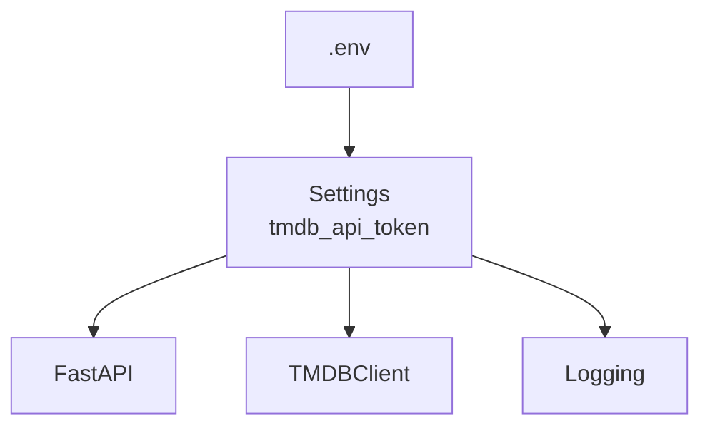
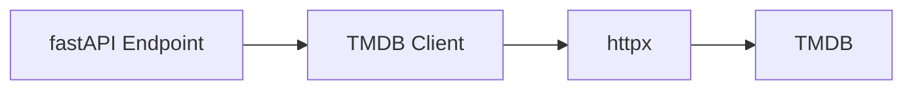
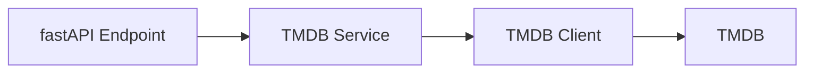
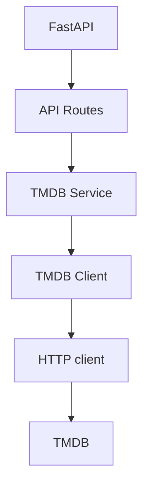
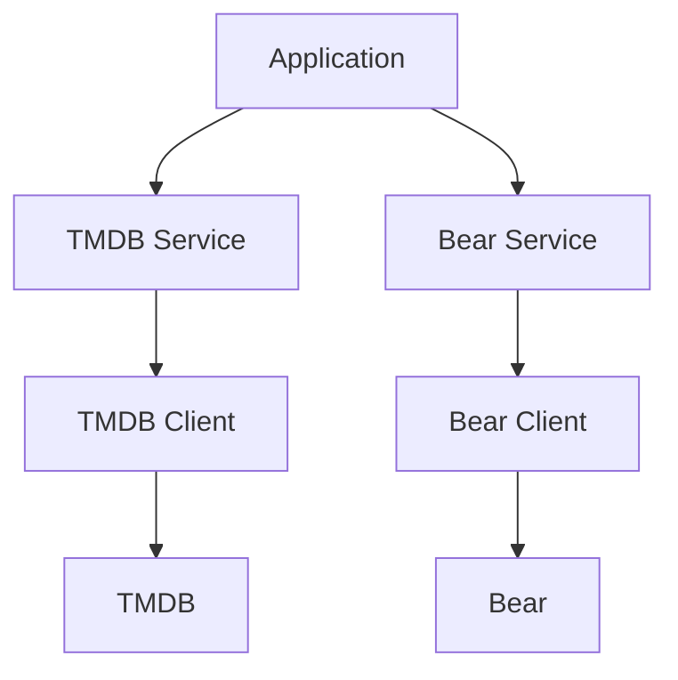
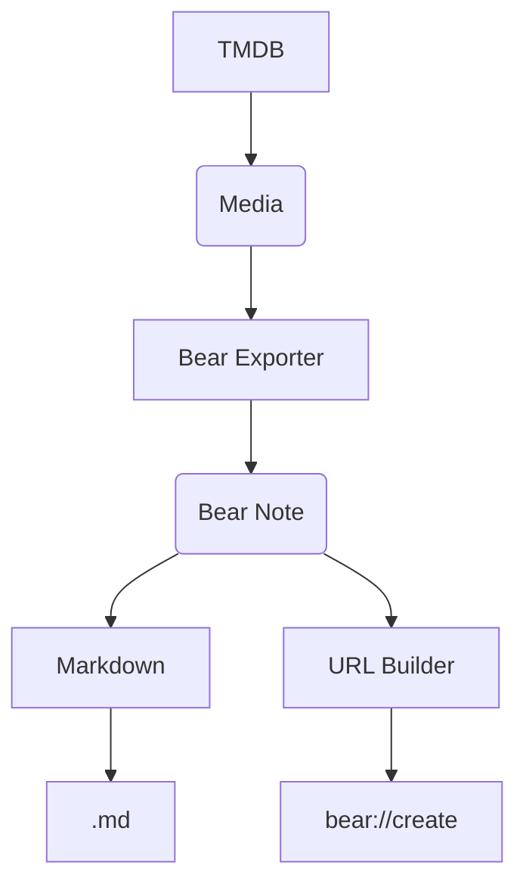

# Tutorial

## Setup
### Make the application directory and change to it
```bash
mkdir movie-to-bear
cd movie-to-bear
```

### Initialise the app with `uv`
```bash
uv init
```

### Create a virtual Python 3.12 environment
```bash
uv python install 3.12
uv python pin 3.12

```

#### Issue
When I ran `uv python pin 3.12` i recevied the following error: 
```bash
error: The requested Python version `3.12` is incompatible with the project `requires-python` value of `>=3.13`.
```

I changed the `pyproject.toml` file:
```yaml
requires-python = ">=3.13"
```
to:
```yaml
requires-python = ">=3.12"
```
Rerunning the command worked:
```bash
Pinned `.python-version` to `3.12`
```

Then run the following: 
```bash
uv sync

```

I changed the `pyproject.toml` file:
```yaml
requires-python = ">=3.12"
```
to:
```yaml
requires-python = ">=3.12,<3.13"
```
### Add dependencies
```bash
uv add fastapi uvicorn httpx pydantic-settings logstruct
```

### Add dev dependencies
```bash
uv add --dev pytest pytest-asyncio coverage ruff
```
### Confirm Python and `uv` versions:
```bash
uv run python --version
uv --version
```

They should be something like:
```bash
Python 3.12.8
uv 0.11.14 (3fdfdc7d4 2026-05-12 x86_64-pc-windows-msvc)
```


## Lesson 1 — Set up the project structure

### 1. Create the diretories
```text
movie-to-bear/
├── .python-version
├── pyproject.toml
├── uv.lock
├── README.md
│
├── src/
│   └── movie_to_bear/
│       ├── __init__.py
│       └── main.py
│
└── tests/
    ├── __init__.py
    └── test_health.py
```

Run in the project folder: 
```bash
mkdir src\movie_to_bear
mkdir tests
```
Create package files:
```powershell
New-Item src\movie_to_bear\__init__.py
New-Item src\movie_to_bear\main.py
New-Item tests\__init__.py
New-Item tests\test_health.py

```

### 2. Install our dependencies
```bash
uv add fastapi uvicorn httpx pydantic-settings logstruct
uv add --dev pytest pytest-asyncio coverage ruff
```

Runtime dependencies
: These are needed when the application runs
Development Dependancies
: These are needed when we are developing/testing

> This was done in the setup already?!

### 3. Configure the `src` layout
The python package is here:
```text
src/
└── movie_to_bear/
```
Our tests are here:
```text
tests/
```

When we run the following:
```bash
uv run pytest

```
We want Python to be able to do:
```python
from movie_to_bear.main import app
```
without manually modifying `PYTHONPATH`.

Configure the package in `pyproject.toml`:

```yaml
[build-system]
requires = ["hatchling"]
build-backend = "hatchling.build"

[tool.hatch.build.targets.wheel]
packages = ["src/movie_to_bear"]
```

Run: 
```bash
uv sync
```

### 4. Create the first FastAPI application
The `src/movie_to_bear/main.py` should contain the below code:
```python
from fastapi import FastAPI


app = FastAPI(
    title="Movie to Bear",
    version="0.1.0",
)


@app.get("/health")
async def health() -> dict[str, str]:
    return {"status": "ok"}
```

### 5. Run the application
From the `terminal`, run:
```bash
uv run uvicorn movie_to_bear.main:app --reload
```

Open in a browser:
```text
http://127.0.0.1:8000/health
```
You should get:
```json
{
  "status": "ok"
}
```
FastAPI will also automatically provide interactive API documentation at:
```text
http://127.0.0.1:8000/docs
```
and the alternative OpenAPI UI at:
```text
http://127.0.0.1:8000/redoc
```

### 6. Now write the test
The `tests/test_health.py` should contain:
```python
from fastapi.testclient import TestClient

from movie_to_bear.main import app


client = TestClient(app)


def test_health() -> None:
    response = client.get("/health")

    assert response.status_code == 200
    assert response.json() == {"status": "ok"}
```

Run the test:
```bash
uv run pytest
```

### 7. Run `coverage`
In the `terminal`, run:
```bash
uv run coverage run -m pytest
```

Then run:
```bash
uv run coverage report
```

## Lesson 2 — Configuration and environment variables
### 1. The problem we're solving
The goal is to make the application able to read configuration such as the TMDB API token without putting secrets into Python source code.

Use `pydantic-settings` to store secrets, etc.

### 2. Create `config.py`
Create `src/movie_to_bear/core/config.py`   
As well as src/movie_to_bear/core/\_\_init\_\_.py`

The `config.py` file should contain the following:
```python
from pydantic_settings import BaseSettings, SettingsConfigDict


class Settings(BaseSettings):
    tmdb_api_token: str

    model_config = SettingsConfigDict(
        env_file=".env",
        env_file_encoding="utf-8",
        case_sensitive=False,
    )


settings = Settings()
```

> Understand the following:
- `BaseSettings`    
    It is designed to populate fields from configuration sources, e.g. environment variables.
- `env_file=".env"`   
    This tells Pydantic Settings to look for a `.env` file.
- `case_sensitive=False`   
    This tells Pydantic Settings to ignore case. 


### 3. Create `.env` file

At the project root, create the `.env` file with the following:
```text
TMDB_API_TOKEN=test-token
```

### 4. Create `.env.example` file
At the project root, create the `.env.example` file:
```text
TMDB_API_TOKEN=
```
This files documents what configuration a developer needs.
The `.env.example` file can be committed to Git.   
The `.env` file should not be.

### 5. Update `.gitignore` file
Check your `.gitignore` file.

If `.env` isn't already there, add:
```text
.env
```

### 6. Test the configuraiton manually
From the `terminal`, run:
```bash
uv run python

```
In the REPL: 
```python
from movie_to_bear.core.config import settings

print(settings.tmdb_api_token)
```

The result should be: 
```text
test-token
```
Exit the REPL with:
```python
exit()
```

### 7. Why not just use `os.getenv()`?

```python
import os

token = os.getenv("TMDB_API_TOKEN")
```
Doing it this way spreads `os.getenv()` throughout the application as it grows. 

Using Pydantic Settings, allows a single configuration object: 

```python
settings.tmdb_api_token
```

### 8. Add a configuration test
Create `tests/test_config.py` with the following content:
```python
from movie_to_bear.core.config import settings


def test_tmdb_api_token_is_loaded() -> None:
    assert settings.tmdb_api_token == "test-token"
```

Run it:
```bash
uv run pytest
```


### 9. One problem with our test
Tests should control their own configuration.
This can be improved using pytest fixtures and environment-variable overrides.

### 10. Configuration precedence
In Pydantic Settings is that configuration can come from different sources.

An environment variable can override the `.env` variable.
For example, in `.env`:
```text
TMDB_API_TOKEN=test-token
``` 
but Powershell has:
```powershell
$env:TMDB_API_TOKEN="another-token"
```
then the environment variable takes precedence.

This is useful in production because `.env` files are not needed.

The Python application doesn't need to know where the value came from.

### 11. What we've achieved
The application as a configuration boundry:


## Lesson 3 — Structured logging
### 1. The target architecture
### 2. Create the logging module
Create `src/movie_to_bear/core/logging.py` with the following content:
```python
import logging
import sys

import structlog


def configure_logging() -> None:
    logging.basicConfig(
        format="%(message)s",
        stream=sys.stdout,
        level=logging.INFO,
    )

    structlog.configure(
        processors=[
            structlog.stdlib.filter_by_level,
            structlog.stdlib.add_logger_name,
            structlog.stdlib.add_log_level,
            structlog.processors.TimeStamper(fmt="iso"),
            structlog.processors.JSONRenderer(),
        ],
        logger_factory=structlog.stdlib.LoggerFactory(),
        wrapper_class=structlog.stdlib.BoundLogger,
        cache_logger_on_first_use=True,
    )
```

### 3. Refactor `main.py`
```python
import structlog
from fastapi import FastAPI

from movie_to_bear.core.logging import configure_logging


def create_app() -> FastAPI:
    configure_logging()

    app = FastAPI(
        title="Movie to Bear",
        version="0.1.0",
    )

    logger = structlog.get_logger()

    @app.get("/health")
    async def health() -> dict[str, str]:
        logger.info(
            "health_check",
            status="ok",
        )

        return {"status": "ok"}

    return app


app = create_app()
```


> Understand the following concepts:
- **Application Factory**   
    ```python
    def create_app() -> FastAPI:
    ```
    This function is capable of constructing our application.
    
    ´´´python
    app = create_app()
    ```
    This creates the normal application instance that `Unicorn` uses.

### 4. Run the tests
```bash
uv run pytest
uv run uvicorn movie_to_bear.main:app --reload
curl http://127.0.0.1:8000/health
```

### 5. Understand what we did
The below code creates an event with two pieces of information, `event` and `status`:
```python
logger.info(
    "health_check",
    status="ok",
)
```
The processes add `logger`, `level` and `timestamp`.

`JSONRenderer` serialises the event.    
We don't construct the JSON ourselves.

Don't do this:
```python
logger.info('{"event": "health_check", "status": "ok"}')
```

### 6. Add a meaningful field

Change the following code in `src\movie_to_bear\main.py`:
```python
logger.info(
    "health_check",
    status="ok",
)
```
to:
```python
logger.info(
    "health_check",
    status="ok",
    component="api",
)
```


### 7. Don't test the JSON string
`structlog` provides testing utilities specifically for capturing log events.

Modify `tests/test_health.py` to contain:
```python
import structlog
from fastapi.testclient import TestClient

from movie_to_bear.main import create_app


def test_health() -> None:
    app = create_app()
    client = TestClient(app)

    with structlog.testing.capture_logs() as logs:
        response = client.get("/health")

    assert response.status_code == 200
    assert response.json() == {"status": "ok"}

    health_logs = [log for log in logs if log["event"] == "health_check"]

    assert len(health_logs) == 1
    assert health_logs[0]["status"] == "ok"
    assert health_logs[0]["component"] == "api"
```

We're not asserting:
```python
assert some_json_string == "..."
```

We're inspecting the actual structured event.   
That makes the test much less brittle.


### 9. A subtle problem
There's something interesting about the code we've just written.

Our test calls:
```python
create_app()
```
and `create_app()` calls:
```python
configure_logging()
```
So every time we create an application, we're configuring global logging.

That's not ideal.

For example, imagine we eventually have:
```bash
test_search_movie
test_search_tv
test_tmdb_error
test_bear_export
test_health
...
```
and each test creates an application.

We don't want every application creation to repeatedly reconfigure global logging.

This is a good example of why application lifecycle and global configuration need to be considered separately.

We're not going to solve that yet.

Instead, I want you to see the problem first.

## Lesson 4 — Build the TMDB HTTP client
### 1. First, understand the TMDB authentication
TMDB's current API supports authentication using an **API Read Access Token**, sent as a Bearer token in the `Authorization` header.

Conceptually, the request looks like this:
```text
GET /3/search/movie?query=The%20Matrix
Authorization: Bearer YOUR_TOKEN
```

### 2. Add the TMDB base URL to configuration
In `src/movie_to_bear/core/config.py`, add: 
```python
class Settings(BaseSettings):
    tmdb_api_token: str
    tmdb_base_url: str = "https://api.themoviedb.org/3" <--
```

Notice that `tmdb_api_token` is mandatory.   
`tmdb_base_url` is optional because it has a default.

> **Secrets/configuration that must be supplied**   
versus   
**configuration with a sensible application default.**   

### 3. Add the HTTP timeout
Also add:
```python
class Settings(BaseSettings):
    tmdb_api_token: str
    tmdb_base_url: str = "https://api.themoviedb.org/3"
    tmdb_timeout: float = 10.0 <--
```

### 4. Create the TMDB client
Create:
```text
src/movie_to_bear/clients/__init__.py
src/movie_to_bear/clients/tmdb.py
```

The client's function is to communicate with TMDB.
It doesn't know anything else about the API - FastAPI, Bear, the HTTP routes, etc. 

### 5. Create TMDBClient
Update `src/movie_to_bear/clients/tmdb.py` with the follwoing content: 
```python
import httpx
import structlog

from movie_to_bear.core.config import Settings


logger = structlog.get_logger()


class TMDBClient:
    def __init__(self, settings: Settings) -> None:
        self._base_url = settings.tmdb_base_url
        self._client = httpx.AsyncClient(
            base_url=self._base_url,
            headers={
                "Authorization": f"Bearer {settings.tmdb_api_token}",
                "Accept": "application/json",
            },
            timeout=settings.tmdb_timeout,
        )

    async def close(self) -> None:
        await self._client.aclose()
```
### 6. Understand the constructor
This: 
```python
self._client = httpx.AsyncClient(...)
```
creates a reuseable async HTTP client.

We're configuring:
```python
base_url = self._base_url
```
so later we can write:
```python
await self._client.get("/search/movie")
```

### 7. Authentication
This:
```python
headers = {
    "Authorization": f"Bearer {settings.tmdb_api_token}",
    "Accept": "application/json",
}
```
means every request made by this client gets:
```text
Authorization: Bearer <token>
Accept: application/json
```
automatically.

That's another reason to encapsulate HTTP communication in a client.

### 8. Add the first API operation
Add:
```python
    async def search_movies(self, query: str) -> dict:
        response = await self._client.get(
            "/search/movie",
            params={
                "query": query,
            },
        )

        response.raise_for_status()

        return response.json()
```

TMDB documents /3/search/movie as the movie search endpoint.

So:
```python
await client.search_movies("The Matrix")
```
eventually results in:
```text
GET /search/movie?query=The+Matrix
```

### 9. Why `raise_for_status()`?
This is important!

If TMDB returns `200` everything continues.
`httpx`raises an exception for anything else. 


### 10. Add logging
```python
    async def search_movies(self, query: str) -> dict:
        logger.info(
            "tmdb_search",
            media_type="movie",
            query=query,
        )

        response = await self._client.get(
            "/search/movie",
            params={
                "query": query,
            },
        )

        response.raise_for_status()

        logger.info(
            "tmdb_response",
            media_type="movie",
            status_code=response.status_code,
        )

        return response.json()
```
> Don't log the API token.


11. But don't call TMDB from a test
We don't want:
```python
async def test_search_movies():
    client = TMDBClient(settings)

    result = await client.search_movies("The Matrix")
```
because it makes a real request.
Instead, our test will replace the HTTP layer with a fake response.
This makes our tests:

- fast
- deterministic
- independent of the Internet
- independent of TMDB availability
- independent of API rate limits

### 12. Before we write the test
Our current TMDBClient creates its own:
```python
httpx.AsyncClient(...)
```
inside:
```python
__init__
```
That makes testing harder.

We could mock the internal _client, but there's a cleaner approach: **dependency injection.**

We'll eventually allow:
```python
TMDBClient(
    settings=settings,
    http_client=mock_http_client,
)
```
during testing.

## Lesson 5 — Dependency injection and mocking httpx

### 1. Modify `TMDBClient`

Change the constructor in `src/movie_to_bear/clients/tmdb.py`:
```python
import httpx
import structlog

from movie_to_bear.core.config import Settings


logger = structlog.get_logger()


class TMDBClient:
    def __init__(
        self,
        settings: Settings,
        http_client: httpx.AsyncClient | None = None,
    ) -> None:
        self._http_client = http_client or httpx.AsyncClient(
            base_url=settings.tmdb_base_url,
            headers={
                "Authorization": f"Bearer {settings.tmdb_api_token}",
                "Accept": "application/json",
            },
            timeout=settings.tmdb_timeout,
        )

    async def close(self) -> None:
        await self._http_client.aclose()

    async def search_movies(self, query: str) -> dict:
        logger.info(
            "tmdb_search",
            media_type="movie",
            query=query,
        )

        response = await self._http_client.get(
            "/search/movie",
            params={"query": query},
        )

        response.raise_for_status()

        logger.info(
            "tmdb_response",
            media_type="movie",
            status_code=response.status_code,
        )

        return response.json()
```

The important part is:
```python
http_client: httpx.AsyncClient | None = None
```
If we don't provide one:
```python
TMDBClient(settings)
```
the class creates a real HTTP client.

But in a test we can provide one:
```python
TMDBClient(
    settings,
    http_client=fake_client,
)
```
That's dependency injection.

### 2. Why this is useful
> A class should receive important external dependencies rather than making them impossible to replace.

### 3. Create the TMDB tests
Create `tests/test_tmdb.py` with the follwing content:
```python
from unittest.mock import AsyncMock

import httpx

from movie_to_bear.clients.tmdb import TMDBClient
from movie_to_bear.core.config import Settings


async def test_search_movies() -> None:
    response = httpx.Response(
        status_code=200,
        json={
            "page": 1,
            "results": [
                {
                    "id": 603,
                    "title": "The Matrix",
                }
            ],
            "total_pages": 1,
            "total_results": 1,
        },
    )

    http_client = AsyncMock(spec=httpx.AsyncClient)
    http_client.get.return_value = response

    settings = Settings(
        tmdb_api_token="test-token",
    )

    client = TMDBClient(
        settings=settings,
        http_client=http_client,
    )

    result = await client.search_movies("The Matrix")

    assert result["page"] == 1
    assert result["results"][0]["id"] == 603
    assert result["results"][0]["title"] == "The Matrix"

    http_client.get.assert_awaited_once_with(
        "/search/movie",
        params={"query": "The Matrix"},
    )
```

### 4. What's happening here?

#### Fake response
An actual `httpx.Response` is constructed:
```python
response = httpx.Response(
    status_code=200,
    json={...},
)
```
No actual request occurs.

#### Fake client
We are creating a mock that behaves like an `AsyncClient`:
```python
http_client = AsyncMock(spec=httpx.AsyncClient)
```

When we make a request to the mock client, no request is made.
The predefined response is returned.

### 5. We're testing more than the result
This assertion is particularly useful:
```python
http_client.get.assert_awaited_once_with(
    "/search/movie",
    params={"query": "The Matrix"},
)
```
We're checking that our client actually made the correct HTTP request.

### 6. Run it

#### Issue
1. Failed: async def functions are not natively supported.
    When running `uv run pytest`, I received the following error:
    ```bash
    tests/test_tmdb.py::test_search_movies - Failed: async def functions are not natively supported.
    ```

    I had to install `pytest-asyncio`:
    ```bash
    uv add --dev pytest-asyncio
    uv sync
    ```

    Configure `pytest` in `pyproject.toml`:
    ```yaml
    [tool.pytest.ini_options]
    asyncio_mode = "auto"
    ```


2. RuntimeError: Cannot call `raise_for_status` as the request instance has not been set on this response.
    In the test code, `httpx` expects the `Response` to be associated with a `Request`. A manually constructed response doesn't have one, so httpx raises this error.

    ```python
    request = httpx.Request(
        "GET",
        "https://api.themoviedb.org/3/search/movie",
    )

    response = httpx.Response(
        status_code=200,
        request=request, <--
        json={
            "page": 1,
            "results": [
                {
                    "id": 603,
                    "title": "The Matrix",
                }
            ],
            "total_pages": 1,
            "total_results": 1,
        },
    )
    ```


### 7. Test a TMDB error
Add the following code to `tests/test_tmdb.py`:
```python
import pytest


async def test_search_movies_raises_for_http_error() -> None:
    request = httpx.Request(
        "GET",
        "https://api.themoviedb.org/3/search/movie",
    )

    response = httpx.Response(
        status_code=500,
        request=request,
        json={"status_message": "Internal Server Error"},
    )

    http_client = AsyncMock(spec=httpx.AsyncClient)
    http_client.get.return_value = response

    settings = Settings(
        tmdb_api_token="test-token",
    )

    client = TMDBClient(
        settings=settings,
        http_client=http_client,
    )

    with pytest.raises(httpx.HTTPStatusError):
        await client.search_movies("The Matrix")
```

### 8. Test that the token is actually used
The client is responsible for constructing the authenticated HTTP client when one isn't injected.

We can test the headers by injecting a fake client and checking that production construction is harder to test directly, but this points us toward a design improvement.

Rather than writing increasingly complicated tests around the constructor, we're going to make the HTTP configuration explicit.

That will lead us to a cleaner design where authentication configuration is isolated.

This will be implemented later.


### 9. Run Ruff

Run the following in the terminal:
```bash
uv run ruff check .
```

Also, run the following:
```bash
uv run ruff format --check .
```

If Ruff reports formatting issues, you can fix them with the following command:
```bash
uv run ruff format .
```

Then run the Ruff check again.


### 10. Run coverage

Finally:
```bash
uv run coverage run -m pytest
uv run coverage report
```

## Lesson 6 — The TMDB service layer
We have the following:

A service layer needs to be introduced: 


The distinction is important:
- Client = knows how to communicate with TMDB.
- Service = knows what our application wants to do with TMDB.
- FastAPI route = handles HTTP requests/responses.

### 1. Why do we need a service?

### 2. Create the service package
Create the following:
```bash
src/movie_to_bear/services/
├── __init__.py
└── tmdb.py
```

### 3. Create TMDBService

Put this into `src/movie_to_bear/services/tmdb.py`:

```python
from movie_to_bear.clients.tmdb import TMDBClient


class TMDBService:
    def __init__(self, client: TMDBClient) -> None:
        self._client = client

    async def search_movies(self, query: str) -> dict:
        return await self._client.search_movies(query)
```


### 4. Client vs service
Now the distinction becomes much more meaningful.

- The client returns **TMDB data**.
- The service returns **application data**.

### 5. Don't return dict forever
We don't want our application to become dependent on arbitrary TMDB JSON structures.   
If TMDB changes their structure, we don't want it to affect us too much.    
The application should eventually have its own model.   

### 6. Test the service

Create `tests/test_tmdb_service.py` with the following content:
```python
from unittest.mock import AsyncMock

from movie_to_bear.services.tmdb import TMDBService


async def test_search_movies() -> None:
    client = AsyncMock()

    client.search_movies.return_value = {
        "page": 1,
        "results": [
            {
                "id": 603,
                "title": "The Matrix",
            }
        ],
        "total_pages": 1,
        "total_results": 1,
    }

    service = TMDBService(client)

    result = await service.search_movies("The Matrix")

    assert result["page"] == 1
    assert result["results"][0]["id"] == 603
    assert result["results"][0]["title"] == "The Matrix"

    client.search_movies.assert_awaited_once_with("The Matrix")
```

We'll mock the **client**, not HTTP.   
Each layer has a focused test.   
The client mocked HTTP   
The service will mock the client.


### 7. Run the tests
Run the tests: 
```bash
uv run pytest
```

### 8. Introducing Pydantic models

Create:
```bash
src/movie_to_bear/models/
├── __init__.py
└── tmdb.py
```

Add the following to `src/movie_to_bear/models/tmdb.py`:
```python
from datetime import date

from pydantic import BaseModel


class MovieSearchResult(BaseModel):
    id: int
    title: str
    release_date: date | None = None
    overview: str | None = None
    poster_path: str | None = None
```

Also add:
```python
class MovieSearchResponse(BaseModel):
    page: int
    results: list[MovieSearchResult]
    total_pages: int
    total_results: int
```


### 9. Why Pydantic belongs here

Suppose TMDB returns:
```json
{
  "id": 603,
  "title": "The Matrix",
  "release_date": "1999-03-30"
}
```
Pydantic converts:
```text
"1999-03-30"
```
into:
```python
date(1999, 3, 30)
```
So our application isn't passing raw JSON strings around.

This becomes particularly valuable when we eventually create the Bear representation.

### 10. Modify the service

Change:
```python
async def search_movies(self, query: str) -> dict:
    return await self._client.search_movies(query)
```
to:
```python
from movie_to_bear.clients.tmdb import TMDBClient
from movie_to_bear.models.tmdb import MovieSearchResponse


class TMDBService:
    def __init__(self, client: TMDBClient) -> None:
        self._client = client

    async def search_movies(
        self,
        query: str,
    ) -> MovieSearchResponse:
        response = await self._client.search_movies(query)

        return MovieSearchResponse.model_validate(response)
```

This is the beginning of our **domain boundary**.


### 11. Update the service test

Change the `` to:
```python
from unittest.mock import AsyncMock

from movie_to_bear.models.tmdb import MovieSearchResponse
from movie_to_bear.services.tmdb import TMDBService


async def test_search_movies() -> None:
    client = AsyncMock()

    client.search_movies.return_value = {
        "page": 1,
        "results": [
            {
                "id": 603,
                "title": "The Matrix",
                "release_date": "1999-03-30",
                "overview": "A computer hacker learns...",
                "poster_path": "/poster.jpg",
            }
        ],
        "total_pages": 1,
        "total_results": 1,
    }

    service = TMDBService(client)

    result = await service.search_movies("The Matrix")

    assert isinstance(result, MovieSearchResponse)
    assert result.page == 1
    assert result.results[0].id == 603
    assert result.results[0].title == "The Matrix"
    assert result.results[0].release_date is not None
    assert result.results[0].release_date.year == 1999

    client.search_movies.assert_awaited_once_with("The Matrix")
```

### 12. One deliberate simplification

You might notice that we're calling:
```python
MovieSearchResponse.model_validate(response)
```
rather than having the HTTP client return a Pydantic model.

That's deliberate.

I'm keeping the responsibilities:

- TMDBClient = HTTP communication
- TMDBService = application interpretation
- Pydantic model = data contract

This separation gives us flexibility later.

## Lesson 7 — FastAPI dependency injection

### 1. Why dependency injection?
> Use FastAPI's dependency injection system to connect all the parts of the application together

We don't want the FastAPI route instantiating objects that it needs each time somebody calls the endpoint. 

FastAPI can construct the dependencies.

This also makes testing easier because the real dependencies can be replaced by mocks.


### 2. Create an API package

Create:
```bash
src/movie_to_bear/api/
├── __init__.py
└── dependencies.py
```

### 3. Create the TMDB client dependency
Add the following content to `src/movie_to_bear/api/dependencies.py`:
```python
from fastapi import Depends

from movie_to_bear.clients.tmdb import TMDBClient
from movie_to_bear.core.config import Settings, settings
from movie_to_bear.services.tmdb import TMDBService


def get_settings() -> Settings:
    return settings


def get_tmdb_client(
    app_settings: Settings = Depends(get_settings),
) -> TMDBClient:
    return TMDBClient(app_settings)


def get_tmdb_service(
    client: TMDBClient = Depends(get_tmdb_client),
) -> TMDBService:
    return TMDBService(client)
```

Three dependencies are created:
1. `get_settings()`
2. `get_tmdb_client()`
3. `get_tmdb_service()`

### 4. Why Depends()?

Consider:
```python
def get_tmdb_service(
    client: TMDBClient = Depends(get_tmdb_client),
) -> TMDBService:
```
We're telling FastAPI:

> Before calling get_tmdb_service, call get_tmdb_client and give me its result.

The chain does not have to be manually constructed each time.

### 5. Create the search router

Create `src/movie_to_bear/api/routes.py` with the following content:
```python
from fastapi import APIRouter, Depends, Query

from movie_to_bear.services.tmdb import TMDBService
from movie_to_bear.api.dependencies import get_tmdb_service
from movie_to_bear.models.tmdb import MovieSearchResponse


router = APIRouter(
    prefix="/api/v1",
)


@router.get(
    "/search/movies",
    response_model=MovieSearchResponse,
)
async def search_movies(
    query: str = Query(min_length=1),
    service: TMDBService = Depends(get_tmdb_service),
) -> MovieSearchResponse:
    return await service.search_movies(query)
```

### 6. Why `response_model`?

This:
```python
response_model = MovieSearchResponse
```
is important.

The service returns:
```python
MovieSearchResponse
```
and FastAPI uses the Pydantic model as the API contract.

The endpoint has a defined response structure.

### 7. `Query(min_length=1)`
The query string is validated:
```python
query: str = Query(min_length=1)
```
So:
```text
/api/v1/search/movies?query=The%20Matrix
```
is valid.

But:
```text
/api/v1/search/movies?query=
```
will be rejected by FastAPI with a validation error.

We're deliberately putting basic HTTP validation at the A


Basic HTTP validation is deliberately being put at the API boundary.


### 8. Connect the router to the application

Modify `src/movie_to_bear/main.py`.
Add:
```python
from movie_to_bear.api.routes import router
```
and inside `create_app()`:
```python
app.include_router(router)
```

### 9. Run the application

Start:
```bash
uv run uvicorn movie_to_bear.main:app --reload
```
Now open:
```text
http://127.0.0.1:8000/docs
```
You should see:
```text
GET /health
GET /api/v1/search/movies
```
FastAPI generated the interactive API documentation automatically from our route definitions and Pydantic models.

### 10. Don't test the real TMDB yet

We're going to test the endpoint without the Internet.   
This is one of the most important benefits of FastAPI dependency injection.

### 11. Override the dependency in the test

Create `tests/test_search.py` with the following content:
```python
from datetime import date

from fastapi.testclient import TestClient

from movie_to_bear.api.dependencies import get_tmdb_service
from movie_to_bear.main import app
from movie_to_bear.models.tmdb import MovieSearchResponse, MovieSearchResult


def test_search_movies() -> None:
    class FakeTMDBService:
        async def search_movies(self, query: str):
            assert query == "The Matrix"

            return MovieSearchResponse(
                page=1,
                results=[
                    MovieSearchResult(
                        id=603,
                        title="The Matrix",
                        release_date=date(1999, 3, 30),
                        overview="A computer hacker...",
                        poster_path="/poster.jpg",
                    )
                ],
                total_pages=1,
                total_results=1,
            )

    fake_service = FakeTMDBService()
    app.dependency_overrides[get_tmdb_service] = lambda: fake_service

    try:
        client = TestClient(app)

        response = client.get(
            "/api/v1/search/movies",
            params={"query": "The Matrix"},
        )

        assert response.status_code == 200

        data = response.json()

        assert data["page"] == 1
        assert data["results"][0]["id"] == 603
        assert data["results"][0]["title"] == "The Matrix"

    finally:
        app.dependency_overrides.clear()
```
### 12. FastAPI dependency overrides
```python
app.dependency_overrides[get_tmdb_service] = FakeTMDBService()
```
This tells FastAPI:

> Whenever the application asks for get_tmdb_service, give it this fake service instead.

### 13. Why try/finally?

This is important:
```python
try:
    ...
finally:
    app.dependency_overrides.clear()
```
Dependency overrides are stored on the FastAPI application object.

If we forget to clear them, another test could accidentally inherit the override.

That creates extremely confusing test failures.

We'll improve this later with a pytest fixture so we don't have to repeat the cleanup manually.

For now, I want you to see what FastAPI is actually doing.

14. Run the tests

Now:
```bash
uv run pytest
```

#### Issue
1. When running: `uv run ruff check .`, the following error occurs:
    ```bash
    B008 Do not perform function call `Depends` in argument defaults; instead, perform the call within the function, or read the default from a module-level singleton variable
    --> src/movie_to_bear/api/dependencies.py:13:30
    |
    12 | def get_tmdb_client(
    13 |     app_settings: Settings = Depends(get_settings),
    |                              ^^^^^^^^^^^^^^^^^^^^^
    14 | ) -> TMDBClient:
    15 |     return TMDBClient(app_settings)
    ```

    This is a **Ruff/flake8-bugbear (B008)** issue, and in this case Ruff is flagging a pattern that is actually idiomatic FastAPI.

    To fix this, configure Ruff to allow `Depends` calls in defaults.   
    Add the following to `pyproject.toml`:

    ```yaml
    [tool.ruff.lint]
    extend-ignore = ["B008"]
    ```
2. FAILED tests/test_search.py::test_search_movies - TypeError: <tests.test_search.test_search_movies.<locals>.FakeTMDBService object at 0x75b3548ee7e0> is not a callable object

    FastAPI expects the override to be a callable — normally a function — but we're giving it an instance.

    Change `tests/test_search.py` from:
    ```python
    app.dependency_overrides[get_tmdb_service] = FakeTMDBService()
    ```
    to:
    ```python
    fake_service = FakeTMDBService()

    app.dependency_overrides[get_tmdb_service] = lambda: fake_service
    ```

## Lesson 8 — Introduce a media domain model

The key design decision is:

> TMDB is an external data source. Our application should not make its internal model depend completely on TMDB's JSON structure.

### 1. The problem with our current model

The current model `MovieSearchResult.py` works from movies. However, it will not work for TV series. We would have to translate TV series data somewhere.   
This is what the service layer is for.

### 2. Create a domain model

Create `src/movie_to_bear/models/media.py` with the following content:
```python
from datetime import date
from enum import StrEnum

from pydantic import BaseModel


class MediaType(StrEnum):
    MOVIE = "movie"
    TV = "tv"


class Media(BaseModel):
    id: int
    media_type: MediaType
    title: str
    overview: str | None = None
    release_date: date | None = None
    poster_path: str | None = None
```


### 3. Why use `StrEnum`?

`StrEnum` gives us string-like enum values.   
This works nicely with JSON APIs and Pydantic.

### 4. Keep the TMDB models

We now have two different concepts:
```text
models/
├── media.py
└── tmdb.py
```

TMDB models are external representations 
Media model is internal representation.

### 5. Update the service

Change the service to translate the TMDB result into our domain model.   

Add the following content to `src/movie_to_bear/models/media.py`:
```python
class MediaSearchResponse(BaseModel):
    page: int
    results: list[Media]
    total_pages: int
    total_results: int
```
### 6. Translate TMDB → domain

Update `services/tmdb.py`:
```python
from movie_to_bear.clients.tmdb import TMDBClient
from movie_to_bear.models.media import (
    Media,
    MediaSearchResponse,
    MediaType,
)
from movie_to_bear.models.tmdb import MovieSearchResponse


class TMDBService:
    def __init__(self, client: TMDBClient) -> None:
        self._client = client

    async def search_movies(
        self,
        query: str,
    ) -> MediaSearchResponse:
        response = await self._client.search_movies(query)

        tmdb_response = MovieSearchResponse.model_validate(response)

        return MediaSearchResponse(
            page=tmdb_response.page,
            results=[
                Media(
                    id=movie.id,
                    media_type=MediaType.MOVIE,
                    title=movie.title,
                    overview=movie.overview,
                    release_date=movie.release_date,
                    poster_path=movie.poster_path,
                )
                for movie in tmdb_response.results
            ],
            total_pages=tmdb_response.total_pages,
            total_results=tmdb_response.total_results,
        )
```

### 7. Update the API response model

The route currently says:
```python
response_model = MovieSearchResponse
```
Change that to:
```python
response_model = MediaSearchResponse
```
and update the return type:
```python
async def search_movies(
    query: str = Query(min_length=1),
    service: TMDBService = Depends(get_tmdb_service),
) -> MediaSearchResponse:
    return await service.search_movies(query)
``` 
Now the public API exposes our model, not TMDB's model.

### 8. Update the service test

Change `tests/test_tmdb_service.py` with the following: 
```python
from movie_to_bear.models.media import MediaSearchResponse, MediaType


result = await service.search_movies("The Matrix")

assert isinstance(result, MediaSearchResponse)
assert result.page == 1
assert result.results[0].id == 603
assert result.results[0].title == "The Matrix"
assert result.results[0].media_type == MediaType.MOVIE
assert result.results[0].release_date is not None
assert result.results[0].release_date.year == 1999
```

We're now testing something meaningful:

> Does the service correctly translate TMDB data into our application's media model?

### 9. Update the API test

Update the fake service with the following:
```python
from movie_to_bear.models.media import (
    Media,
    MediaSearchResponse,
    MediaType,
)

fake_response = MediaSearchResponse(
    page=1,
    results=[
        Media(
            id=603,
            media_type=MediaType.MOVIE,
            title="The Matrix",
            release_date="1999-03-30",
            overview="A computer hacker...",
            poster_path="/poster.jpg",
        )
    ],
    total_pages=1,
    total_results=1,
)
return fake_response
```
### 10. Run everything
```bash
uv run ruff check .
uv run ruff format --check .
uv run coverage run -m pytest
uv run coverage report
```
## Lesson 9 — TMDB TV search

### 1. Add a TV model

Add new models to `src/movie_to_bear/models/tmdb.py`:
```python
class TVSearchResult(BaseModel):
    id: int
    name: str
    first_air_date: date | None = None
    overview: str | None = None
    poster_path: str | None = None


class TVSearchResponse(BaseModel):
    page: int
    results: list[TVSearchResult]
    total_pages: int
    total_results: int
```

### 2. Add `search_tv()`to the client
Add the following content to `src/movie_to_bear/clients/tmdb.py`:
```python
async def search_tv(self, query: str) -> dict:
    logger.info(
        "tmdb_search",
        media_type="tv",
        query=query,
    )

    response = await self._http_client.get(
        "/search/tv",
        params={"query": query},
    )

    response.raise_for_status()

    logger.info(
        "tmdb_response",
        media_type="tv",
        status_code=response.status_code,
    )

    return response.json()
```

### 3. Add TV search to the service

Add the following to `src/movie_to_bear/services/tmdb.py`:
```python
from movie_to_bear.models.tmdb import (
    MovieSearchResponse,
    TVSearchResponse,
)


async def search_tv(
    self,
    query: str,
) -> MediaSearchResponse:
    response = await self._client.search_tv(query)

    tmdb_response = TVSearchResponse.model_validate(response)

    return MediaSearchResponse(
        page=tmdb_response.page,
        results=[
            Media(
                id=show.id,
                media_type=MediaType.TV,
                title=show.name,
                overview=show.overview,
                release_date=show.first_air_date,
                poster_path=show.poster_path,
            )
            for show in tmdb_response.results
        ],
        total_pages=tmdb_response.total_pages,
        total_results=tmdb_response.total_results,
    )
```

### 4. Add the TV route
Add the following content to `src/movie_to_bear/api/routes.py`:
```python
from movie_to_bear.models.media import MediaSearchResponse


@router.get(
    "/search/tv",
    response_model=MediaSearchResponse,
)
async def search_tv(
    query: str = Query(min_length=1),
    service: TMDBService = Depends(get_tmdb_service),
) -> MediaSearchResponse:
    return await service.search_tv(query)
```

### 5. Test the TMDB client
Add the following to `tests/test_tmdb.py`:
```python
async def test_search_tv() -> None:
    request = httpx.Request(
        "GET",
        "https://api.themoviedb.org/3/search/tv",
    )

    response = httpx.Response(
        status_code=200,
        request=request,
        json={
            "page": 1,
            "results": [
                {
                    "id": 1399,
                    "name": "Game of Thrones",
                    "first_air_date": "2011-04-17",
                    "overview": "Seven noble families...",
                    "poster_path": "/poster.jpg",
                }
            ],
            "total_pages": 1,
            "total_results": 1,
        },
    )

    http_client = AsyncMock(spec=httpx.AsyncClient)
    http_client.get.return_value = response

    settings = Settings(
        tmdb_api_token="test-token",
    )

    client = TMDBClient(
        settings=settings,
        http_client=http_client,
    )

    result = await client.search_tv("Game of Thrones")

    assert result["page"] == 1
    assert result["results"][0]["id"] == 1399
    assert result["results"][0]["name"] == "Game of Thrones"

    http_client.get.assert_awaited_once_with(
        "/search/tv",
        params={"query": "Game of Thrones"},
    )
```


### 6. Test the service translation

Add the following to `tests/test_tmdb_service.py`:

```python
async def test_search_tv() -> None:
    client = AsyncMock()

    client.search_tv.return_value = {
        "page": 1,
        "results": [
            {
                "id": 1399,
                "name": "Game of Thrones",
                "first_air_date": "2011-04-17",
                "overview": "Seven noble families...",
                "poster_path": "/poster.jpg",
            }
        ],
        "total_pages": 1,
        "total_results": 1,
    }

    service = TMDBService(client)

    result = await service.search_tv("Game of Thrones")

    assert isinstance(result, MediaSearchResponse)
    assert result.page == 1

    media = result.results[0]

    assert media.id == 1399
    assert media.title == "Game of Thrones"
    assert media.media_type == MediaType.TV
    assert media.release_date is not None
    assert media.release_date.year == 2011

    client.search_tv.assert_awaited_once_with("Game of Thrones")
```


### 7. Test the API
Add another test to `tests/test_search.py`:
```python
class FakeTMDBService:
    async def search_movies(self, query: str) -> MediaSearchResponse:
        return MediaSearchResponse(
            page=1,
            results=[
                Media(
                    id=603,
                    media_type=MediaType.MOVIE,
                    title="The Matrix",
                    release_date="1999-03-30",
                )
            ],
            total_pages=1,
            total_results=1,
        )

    async def search_tv(self, query: str) -> MediaSearchResponse:
        return MediaSearchResponse(
            page=1,
            results=[
                Media(
                    id=1399,
                    media_type=MediaType.TV,
                    title="Game of Thrones",
                    release_date="2011-04-17",
                )
            ],
            total_pages=1,
            total_results=1,
        )
```


### 8. Run the tests


### 9. We now have a useful abstraction
TMDB has two different APIs with two different response formats.   
The application only has one.   


### 10. One thing I want you to notice
We have two endpoints:
- movies
- tv

We want to allow the user to search for a title, and not be bothered with weather it is a movie or a tv series.


## Lesson 10 — FastAPI lifespan and resource management

### 1. Why not create the client inside the endpoint?

An AsyncClient maintains connection pooling.    
We do not want to create and close a new HTTP client for every request.   
Instead, we want one application-level client that can be reused.

### 2. Create an application state object
Create `src/movie_to_bear/core/state.py`:
```python
import httpx

from movie_to_bear.clients.tmdb import TMDBClient
from movie_to_bear.core.config import Settings


class AppState:
    def __init__(self, settings: Settings) -> None:
        self.http_client = httpx.AsyncClient(
            base_url="https://api.themoviedb.org/3",
            headers={
                "Authorization": f"Bearer {settings.tmdb_api_token}",
                "accept": "application/json",
            },
        )

        self.tmdb_client = TMDBClient(
            settings=settings,
            http_client=self.http_client,
        )

    async def close(self) -> None:
        await self.http_client.aclose()
```

The important part is that `AppState` owns the HTTP client.

### 3. Use FastAPI lifespan

Modify `src/movie_to_bear/main.py`:
```python
from contextlib import asynccontextmanager

from fastapi import FastAPI

from movie_to_bear.core.config import settings


@asynccontextmanager
async def lifespan(app: FastAPI):
    app.state.app_state = AppState(settings)

    yield

    await app.state.app_state.close()


def create_app() -> FastAPI:
    configure_logging()

    app = FastAPI(
        title="Movie to Bear",
        version="0.1.0",
        lifespan=lifespan,
    )

    ...
```
The key concept is:
```text
before yield
    startup


yield
    application runs


after yield
    shutdown
```
So:
```python
app.state.app_state = AppState(settings)
```
runs when the application starts.

And:
```python
await app.state.app_state.close()
```
runs when it shuts down.


### 4. Get the TMDB client from application state
The client does not need to constructed here.   
Change `src/movie_to_bear/api/dependencies.py`:
```python
from fastapi import Depends, Request

from movie_to_bear.clients.tmdb import TMDBClient
from movie_to_bear.services.tmdb import TMDBService


def get_tmdb_client(request: Request) -> TMDBClient:
    return request.app.state.app_state.tmdb_client


def get_tmdb_service(
    client: TMDBClient = Depends(get_tmdb_client),
) -> TMDBService:
    return TMDBService(client)
```


### 5. The dependency graph is now cleaner

### 6. What happens during application startup?
When you run `uv run uvicorn movie_to_bear.main:app --reload`, FastAPI start the lifespan.
It executes:  
```python
app.state.app_state = AppState(settings)
```
which creates:
```text
AppState
   ├── AsyncClient
   └── TMDBClient
```
Then the application starts accepting requests.


### 7. What happens during shutdown?
When `uvicorn` shuts the application down:
```python
await app.state.app_state.close()
```
runs.

This calls:
```python
await self.http_client.aclose()
```
The connection pool is properly released.

### 8. Test the lifespan
This should be explicitly tested.
Create `tests/test_lifespan.py` with the following content:
```python
from fastapi.testclient import TestClient

from movie_to_bear.main import app


def test_application_lifespan() -> None:
    with TestClient(app):
        assert hasattr(app.state, "app_state")

        assert app.state.app_state.tmdb_client is not None
        assert app.state.app_state.http_client is not None
```

The context manager causes the FastAPI lifespan to execute: `with TestClient(app):`

### 9. One problem with our current tests

### 10. Test the shutdown
Increase the strength of the lifecycle test:
```python
def test_application_lifespan() -> None:
    with TestClient(app):
        http_client = app.state.app_state.http_client

        assert not http_client.is_closed

    assert http_client.is_closed
```


### 11. Run the tests


#### Issue
Received the following issue running the tests:
```
    def test_application_lifespan() -> None:
        with TestClient(app):
>           assert hasattr(app.state, "app_state")
E           AssertionError: assert False
E            +  where False = hasattr(<starlette.datastructures.State object at 0x7d1b878a4800>, 'app_state')
E            +    where <starlette.datastructures.State object at 0x7d1b878a4800> = app.state

tests/test_lifespan.py:8: AssertionError
``` 

The wrong state object is being checked.  
`TestClient` runs the app's lifespan use its own application lifecycle context.   
Starlette provides a lifespan state mechanism rather than requiring us to mutate `app.state`directly.

### 12. One important correction to our architecture



### 13 Why this matters for Bear

Bear is another external integration:

The application state could look like the following:
```text
AppState
├── http_client
├── tmdb_client
└── ...
```
### Issue

1. AssertionError 
    ```bash
    def test_application_lifespan() -> None: 
        with TestClient(app): 
        > assert hasattr(app.state, "app_state") 
        E AssertionError: assert False 
        E + where False = hasattr(<starlette.datastructures.State object at 0x7d1b878a4800>, 'app_state') 
        E + where <starlette.datastructures.State object at 0x7d1b878a4800> = app.state 
        
        tests/test_lifespan.py:8: AssertionError
    ```
    This is due to checking the incorrect state object.   
    `TestClient`runs the application lifespan using its own application lifecycle context.    
    Starlette provides a lifespan state mechanism, it is not necessary to mutate `app.state` directly.

    Change `main.py`:
    ```python
    from contextlib import asynccontextmanager
    from collections.abc import AsyncIterator

    import structlog
    from fastapi import FastAPI

    from movie_to_bear.api.routes import router
    from movie_to_bear.core.config import settings
    from movie_to_bear.core.logging import configure_logging
    from movie_to_bear.core.state import AppState


    @asynccontextmanager
    async def lifespan(app: FastAPI) -> AsyncIterator[None]:
        app_state = AppState(settings)  <--

        try:                            <--
            yield {                     <--
                "app_state": app_state, <--
            }                           <--
        finally:                        <--
            await app_state.close()


    def create_app() -> FastAPI:
        configure_logging()

        app = FastAPI(
            title="Movie to Bear",
            version="0.1.0",
            lifespan=lifespan,
        )

        ...


    ```
    Change `src/movie_to_bear/api/dependencies.py`:
    ```python
    from fastapi import Depends, Request

    from movie_to_bear.clients.tmdb import TMDBClient
    from movie_to_bear.services.tmdb import TMDBService


    def get_tmdb_client(request: Request) -> TMDBClient:
        return request.state.app_state.tmdb_client <--


    def get_tmdb_service(
        client: TMDBClient = Depends(get_tmdb_client),
    ) -> TMDBService:
        return TMDBService(client)

    ```

    Change `tests/test_lifespan.py` to:
    ```python
    from fastapi.testclient import TestClient

    from movie_to_bear.main import app


    def test_application_lifespan() -> None:
        with TestClient(app) as client:
            response = client.get("/health")

            assert response.status_code == 200
    ```
2. Return type of async generator function must be compatible with "AsyncGenerator[dict[str, AppState], Any]" in main.py ln 17, col 15

    This was a typing issue.   
    The relevant changes to `main.py` should be:
    ```python
    from collections.abc import AsyncIterator
    from contextlib import asynccontextmanager

    import structlog
    from fastapi import FastAPI

    from movie_to_bear.api.routes import router
    from movie_to_bear.core.config import settings
    from movie_to_bear.core.logging import configure_logging
    from movie_to_bear.core.state import AppState


    @asynccontextmanager
    async def lifespan(app: FastAPI) -> AsyncIterator[dict[str, AppState]]:
        app_state = AppState(settings)

        try:
            yield {
                "app_state": app_state,
            }
        finally:
            await app_state.close()
    ```

3. The function "asynccontextmanager" is deprecated   Annotating the return type as -> AsyncIterator[Foo] with @asynccontextmanager is deprecated. Use -> AsyncGenerator[Foo] instead.

    Change `main.py` so the complete lifespan is:
    ```python
    from collections.abc import AsyncGenerator
    from contextlib import asynccontextmanager


    @asynccontextmanager
    async def lifespan(app: FastAPI) -> AsyncGenerator[dict[str, AppState], None]:
        app_state = AppState(settings)

        try:
            yield {
                "app_state": app_state,
            }
        finally:
            await app_state.close()
    ```


## Lesson 11 — One search endpoint for Movies + TV

### 1. Add a unified search method

Add the following code to `src/movie_to_bear/services/tmdb.py`:
```python
import asyncio

...


async def search(
    self,
    query: str,
) -> MediaSearchResponse:
    movie_response, tv_response = await asyncio.gather(
        self.search_movies(query),
        self.search_tv(query),
    )

    return MediaSearchResponse(
        page=1,
        results=[
            *movie_response.results,
            *tv_response.results,
        ],
        total_pages=max(
            movie_response.total_pages,
            tv_response.total_pages,
        ),
        total_results=(movie_response.total_results + tv_response.total_results),
    )
``` 

#### Why `asyncio.gather()`?

We have two independent HTTP requests:
1. Search Movie
2. Search TV

There is no reason to wait for the movie request to finish before starting the TV request.

They can run concurrently using `asyncio.gather(...)`.

This reduces the combined latency to approximately the slower of the two requests.


### 2. Be careful with pagination

TMDB paginates movie and TV results independently.
Movie and TV page 1 doesn't map to a combined page 1.


### 3. Add the route

Add the following to `src/movie_to_bear/api/routes.py`:
```python
@router.get(
    "/search",
    response_model=MediaSearchResponse,
)
async def search(
    query: str = Query(min_length=1),
    service: TMDBService = Depends(get_tmdb_service),
) -> MediaSearchResponse:
    return await service.search(query)
```

### 4. Test the service

Add the following to `` to test the orchestration, not TMDB itself:
```python
async def test_search() -> None:
    client = AsyncMock()

    client.search_movies.return_value = {
        "page": 1,
        "results": [
            {
                "id": 603,
                "title": "The Matrix",
                "release_date": "1999-03-30",
                "overview": "A computer hacker...",
                "poster_path": "/poster.jpg",
            }
        ],
        "total_pages": 1,
        "total_results": 1,
    }

    client.search_tv.return_value = {
        "page": 1,
        "results": [
            {
                "id": 1399,
                "name": "Game of Thrones",
                "first_air_date": "2011-04-17",
                "overview": "Seven noble families...",
                "poster_path": "/poster.jpg",
            }
        ],
        "total_pages": 1,
        "total_results": 1,
    }

    service = TMDBService(client)

    result = await service.search("test")

    assert result.page == 1
    assert len(result.results) == 2

    assert result.results[0].media_type == MediaType.MOVIE
    assert result.results[0].title == "The Matrix"

    assert result.results[1].media_type == MediaType.TV
    assert result.results[1].title == "Game of Thrones"

    assert result.total_results == 2

    client.search_movies.assert_awaited_once_with("test")
    client.search_tv.assert_awaited_once_with("test")
```

### 5. Test the API endpoint
Add the following code to `tests/test_search.py`:
```python
def test_search() -> None:
    fake_service = FakeTMDBService()

    app.dependency_overrides[get_tmdb_service] = lambda: fake_service

    try:
        client = TestClient(app)

        response = client.get(
            "/api/v1/search",
            params={"query": "The Office"},
        )

        assert response.status_code == 200

        data = response.json()

        assert len(data["results"]) == 2

        assert data["results"][0]["media_type"] == "movie"
        assert data["results"][1]["media_type"] == "tv"

    finally:
        app.dependency_overrides.clear()
```
As well as the following to `FakeTMDBService()`: 
```python
async def search(
    self,
    query: str,
) -> MediaSearchResponse:
    return MediaSearchResponse(
        page=1,
        results=[
            Media(
                id=603,
                media_type=MediaType.MOVIE,
                title="The Matrix",
            ),
            Media(
                id=1399,
                media_type=MediaType.TV,
                title="Game of Thrones",
            ),
        ],
        total_pages=1,
        total_results=2,
    )
```

### 6. Run the tests


## Lesson 12 — Design the Bear export

### 1. First, define what we want to export

A sensible first Bear note might look like the following:
```markdown
# The Matrix

**Type:** Movie
**Release date:** 30 March 1999
**TMDB ID:** 603

## Overview

A computer hacker discovers...
```

### 2. Don't put Bear formatting into Media

`Media` represents our application's media data.    
It shouldn't know that we're exporting to Bear.   
In the future, we may need to export to other formats or apps.


### 3. Create an exporter package

Create:
```text
src/movie_to_bear/exporters/
├── __init__.py
└── bear.py

```

Then add the following content to `src/movie_to_bear/exporters/bear.py`:
```python
from movie_to_bear.models.media import Media


class BearExporter:
    def export(self, media: Media) -> str: ...
```
The exporter generates the representation.   
A separate component can eventually handle the file.

### 4. Define the output format
```python
from movie_to_bear.models.media import Media, MediaType


class BearExporter:
    def export(self, media: Media) -> str:
        lines = [
            f"# {media.title}",
            "",
            f"**Type:** {self._media_type(media)}",
        ]

        if media.release_date:
            lines.append(f"**Release date:** {media.release_date.strftime('%d %B %Y')}")

        lines.extend(
            [
                f"**TMDB ID:** {media.id}",
                "",
            ]
        )

        if media.overview:
            lines.extend(
                [
                    "## Overview",
                    "",
                    media.overview,
                    "",
                ]
            )

        return "\n".join(lines)

    @staticmethod
    def _media_type(media: Media) -> str:
        if media.media_type == MediaType.MOVIE:
            return "Movie"

        return "TV Show"
```
### 5. Let's look at the result

Given:
```python 
Media(
    id=603,
    media_type=MediaType.MOVIE,
    title="The Matrix",
    release_date="1999-03-30",
    overview="A computer hacker...",
)
````
the exporter produces:
```markdown
# The Matrix

**Type:** Movie
**Release date:** 30 March 1999
**TMDB ID:** 603

## Overview

A computer hacker...
```

The important thing is that the exporter knows nothing about:
- TMDB API
- TMDB URLs
- TMDB JSON
- HTTP
- FastAPI

It only knows:
- Media


### 6. Test the exporter

Create `tests/test_bear_exporter.py` with the follwoing content: 
```python
from movie_to_bear.exporters.bear import BearExporter
from movie_to_bear.models.media import Media, MediaType


def test_export_movie() -> None:
    media = Media(
        id=603,
        media_type=MediaType.MOVIE,
        title="The Matrix",
        release_date="1999-03-30",
        overview="A computer hacker...",
    )

    exporter = BearExporter()

    result = exporter.export(media)

    assert "# The Matrix" in result
    assert "**Type:** Movie" in result
    assert "**Release date:** 30 March 1999" in result
    assert "**TMDB ID:** 603" in result
    assert "## Overview" in result
    assert "A computer hacker..." in result


def test_export_tv_show() -> None:
    media = Media(
        id=1399,
        media_type=MediaType.TV,
        title="Game of Thrones",
        release_date="2011-04-17",
        overview="Seven noble families...",
    )

    exporter = BearExporter()

    result = exporter.export(media)

    assert "# Game of Thrones" in result
    assert "**Type:** TV Show" in result
    assert "**Release date:** 17 April 2011" in result
    assert "**TMDB ID:** 1399" in result
```

### 7. Why these tests are valuable

This is a pure unit test.
It's fast and deterministic.

### 8. Run the checks

## Lesson 13 — Build the Bear Markdown exporter properly


### 1. Add a TMDB link
```markdown
# The Matrix

**Type:** Movie  
**Release date:** 30 March 1999  
**TMDB ID:** 603  

[View on TMDB](https://www.themoviedb.org/movie/603)

## Overview

A computer hacker...
```
The exported note should contain a useful link back to TMDB.
TMDB's URL structure is predictable from the media type and ID.

Let's put the responsibility of constructing the link back in the Media model.

Add the following to `src/movie_to_bear/models/media.py`:
```python
@property
def tmdb_url(self) -> str:
    if self.media_type == MediaType.MOVIE:
        return f"https://www.themoviedb.org/movie/{self.id}"

    return f"https://www.themoviedb.org/tv/{self.id}"
```

### 2. Add tags
Bear's Markdown supports tags, and tags are useful for organizing the imported notes. Bear also supports tags through its X-Callback-URL API.

Add a method to `src/movie_to_bear/exporters/bear.py`:
```python
@staticmethod
def _tag(media: Media) -> str:
    if media.media_type == MediaType.MOVIE:
        return "#movies"

    return "#tv"
```
### 3. Update the exporter

Update `src/movie_to_bear/exporters/bear.py` to the following:
```python
from movie_to_bear.models.media import Media, MediaType


class BearExporter:
    def export(self, media: Media) -> str:
        lines = [
            f"# {media.title}",
            "",
            self._tag(media),
            "",
            f"**Type:** {self._media_type(media)}",
        ]

        if media.release_date:
            lines.append(f"**Release date:** {media.release_date.strftime('%d %B %Y')}")

        lines.extend(
            [
                f"**TMDB ID:** {media.id}",
                f"[View on TMDB]({media.tmdb_url})",
                "",
            ]
        )

        if media.overview:
            lines.extend(
                [
                    "## Overview",
                    "",
                    media.overview,
                    "",
                ]
            )

        return "\n".join(lines)

    @staticmethod
    def _media_type(media: Media) -> str:
        if media.media_type == MediaType.MOVIE:
            return "Movie"

        return "TV Show"

    @staticmethod
    def _tag(media: Media) -> str:
        if media.media_type == MediaType.MOVIE:
            return "#movies"

        return "#tv"
```


### 4. Test the Markdown

Update the movie test in `tests/test_bear_exporter.py`:
```python
def test_export_movie() -> None:
    media = Media(
        id=603,
        media_type=MediaType.MOVIE,
        title="The Matrix",
        release_date=date(1999, 3, 30),
        overview="A computer hacker...",
    )

    exporter = BearExporter()

    result = exporter.export(media)

    assert "# The Matrix" in result
    assert "#movies" in result
    assert "**Type:** Movie" in result
    assert "**Release date:** 30 March 1999" in result
    assert "**TMDB ID:** 603" in result
    assert "[View on TMDB]" in result
    assert "https://www.themoviedb.org/movie/603" in result
```
And the TV test:
```python
def test_export_tv_show() -> None:
    media = Media(
        id=1399,
        media_type=MediaType.TV,
        title="Game of Thrones",
        release_date=date(2011, 4, 17),
        overview="Seven noble families...",
    )

    exporter = BearExporter()

    result = exporter.export(media)

    assert "# Game of Thrones" in result
    assert "#tv" in result
    assert "**Type:** TV Show" in result
    assert "https://www.themoviedb.org/tv/1399" in result
```

### 5. One important design improvement

Instead of return a Markdown string, use a BearNote class.
The Bear X-Callback-URL API has separate concepts for `title`, `text`, and `tags` rather than a massive Markdown string. 

### 6. So let's make that change now
Create `src/movie_to_bear/models/bear.py` with the following content:
```python
from pydantic import BaseModel


class BearNote(BaseModel):
    title: str
    text: str
    tags: list[str]
```

## Lesson 14 — Build the Bear X-Callback URL exporter

### 1. Create a BearURLBuilder

Create `src/movie_to_bear/exporters/bear_url.py` with the following content:
```python
from urllib.parse import urlencode

from movie_to_bear.models.bear import BearNote


class BearURLBuilder:
    BASE_URL = "bear://x-callback-url/create"

    def build(self, note: BearNote) -> str:
        params = {
            "title": note.title,
            "text": note.text,
            "tags": ",".join(note.tags),
        }

        return f"{self.BASE_URL}?{urlencode(params)}"
```
#### Why urlencode()?
We should not contruct the URL manually:
```python
f"bear://x-callback-url/create?title={note.title}&text={note.text}"
```

This is because titles and titles can contain: spaces
- &
- ?
- /
- "#"
- %
- newlines
- Unicode

### 2. Test URL generation

Create `tests/test_bear_url.py` with the following content:
```python
from movie_to_bear.exporters.bear_url import BearURLBuilder
from movie_to_bear.models.bear import BearNote


def test_build_bear_create_url() -> None:
    note = BearNote(
        title="The Matrix",
        text="A computer hacker...",
        tags=["movies", "tmdb"],
    )

    builder = BearURLBuilder()

    result = builder.build(note)

    assert result.startswith("bear://x-callback-url/create?")

    assert "title=The+Matrix" in result
    assert "text=A+computer+hacker..." in result
    assert "tags=movies%2Ctmdb" in result
```

### 3. Test special characters

This test is important.   
Add the following method to `tests/test_bear_url.py`:
```python
def test_build_bear_create_url_encodes_special_characters() -> None:
    note = BearNote(
        title="The Matrix: Reloaded & More",
        text="Line one\nLine two",
        tags=["movies", "science fiction"],
    )

    builder = BearURLBuilder()

    result = builder.build(note)

    assert "The+Matrix%3A+Reloaded+%26+More" in result
    assert "Line+one%0ALine+two" in result
    assert "science+fiction" in result
```
This protects against building an invalid URL when the user's movie title contains punctuation or whitespace.

### 4. Let's improve `BearNote`

Keep the model simple.   
It represents the data we need to send to Bear's `/create` action as per the current documentation.

### 5. Separate content generation from URL generation

The URL builder has a single responsibility. 

### 6. Update `BearExporter`

Our exporter should return a `BearNote`:
```python
from movie_to_bear.models.bear import BearNote
from movie_to_bear.models.media import Media, MediaType


class BearExporter:
    def export(self, media: Media) -> BearNote:
        lines = [
            f"**Type:** {self._media_type(media)}",
            "",
        ]

        if media.release_date:
            lines.append(f"**Release date:** {media.release_date.strftime('%d %B %Y')}")

        lines.extend(
            [
                f"**TMDB ID:** {media.id}",
                f"[View on TMDB]({media.tmdb_url})",
                "",
            ]
        )

        if media.overview:
            lines.extend(
                [
                    "## Overview",
                    "",
                    media.overview,
                ]
            )

        return BearNote(
            title=media.title,
            text="\n".join(lines),
            tags=[self._tag(media)],
        )

    @staticmethod
    def _media_type(media: Media) -> str:
        if media.media_type == MediaType.MOVIE:
            return "Movie"

        return "TV Show"

    @staticmethod
    def _tag(media: Media) -> str:
        if media.media_type == MediaType.MOVIE:
            return "movies"

        return "tv"
```

Also, because Bear's `/create` API expects tags as a comma-separated list of tag names, we've removed the '#' from the tags.

### 7. Update the exporter test

Instead of testing values in the Markdown string, the `BearNote` should be tested.
Update the `test_bear_exporter.py` with the following:
```python
def test_export_movie() -> None:
    media = Media(
        id=603,
        media_type=MediaType.MOVIE,
        title="The Matrix",
        release_date="1999-03-30",
        overview="A computer hacker...",
    )

    exporter = BearExporter()

    result = exporter.export(media)

    assert result.title == "The Matrix"
    assert result.tags == ["movies"]

    assert "**Type:** Movie" in result.text
    assert "**Release date:** 30 March 1999" in result.text
    assert "**TMDB ID:** 603" in result.text
    assert "https://www.themoviedb.org/movie/603" in result.text
    assert "A computer hacker..." in result.text


def test_export_tv_show() -> None:
    media = Media(
        id=1399,
        media_type=MediaType.TV,
        title="Game of Thrones",
        release_date="2011-04-17",
        overview="Seven noble families...",
    )

    exporter = BearExporter()

    result = exporter.export(media)

    assert result.title == "Game of Thrones"
    assert result.tags == ["tv"]

    assert "**Type:** TV Show" in result.text
    assert "https://www.themoviedb.org/tv/1399" in result.text
```
### 8. Our architecture is now becoming very clean


### 9. Run everything

## Lesson 15 — POST /api/v1/export/bear


### 1. Create an export response model

Create `src/movie_to_bear/models/export.py` with the following content:
```python
from pydantic import BaseModel


class BearExportResponse(BaseModel):
    title: str
    url: str
```

Why return a model instead of a `dict`.
FastAPI can validate and document the response automatically.

### 2. Decide what the endpoint accepts

The simplest first version is:
```text
POST /api/v1/export/bear
```
with:
```json
{
  "media_id": 603,
  "media_type": "movie"
}
```
The application then retrieves the complete media information from TMDB.

This is better than asking the client to send the entire Media object.

### 3. Create the request model

Update `src/movie_to_bear/models/export.py` so it looks like the below script:

```python
from pydantic import BaseModel

from movie_to_bear.models.media import MediaType


class BearExportRequest(BaseModel):
    media_id: int
    media_type: MediaType


class BearExportResponse(BaseModel):
    title: str
    url: str
```

### 4. Add a service method

Add an export operation to our service layer.
Add `src/movie_to_bear/services/tmdb.py` the following:
```python
async def get_media(
    self,
    media_id: int,
    media_type: MediaType,
) -> Media:
    if media_type == MediaType.MOVIE:
        return await self.get_movie(media_id)

    return await self.get_tv(media_id)
```
`get_media()` is useful because the export operation doesn't need to care whether it's dealing with a movie or TV show.

### 5. Create an export service

Create `src/movie_to_bear/services/export.py` with the following content:
```python
from movie_to_bear.exporters.bear import BearExporter
from movie_to_bear.exporters.bear_url import BearURLBuilder
from movie_to_bear.models.export import BearExportResponse
from movie_to_bear.models.media import Media
from movie_to_bear.models.media import MediaType
from movie_to_bear.services.tmdb import TMDBService


class ExportService:
    def __init__(
        self,
        tmdb_service: TMDBService,
        bear_exporter: BearExporter,
        bear_url_builder: BearURLBuilder,
    ) -> None:
        self.tmdb_service = tmdb_service
        self.bear_exporter = bear_exporter
        self.bear_url_builder = bear_url_builder

    async def export_to_bear(
        self,
        media_id: int,
        media_type: MediaType,
    ) -> BearExportResponse:
        media = await self.tmdb_service.get_media(
            media_id,
            media_type,
        )

        note = self.bear_exporter.export(media)

        url = self.bear_url_builder.build(note)

        return BearExportResponse(
            title=note.title,
            url=url,
        )
```

### 6. Why have ExportService?

Routes should not have orchestration logic.

> Routes handle HTTP. Services handle application logic.

### 7. Dependency injection

We need a dependency for `ExportService`.

Add the following to `src/movie_to_bear/api/dependencies.py`:
```python
from movie_to_bear.exporters.bear import BearExporter
from movie_to_bear.exporters.bear_url import BearURLBuilder
from movie_to_bear.services.export import ExportService


def get_export_service(
    tmdb_service: TMDBService = Depends(get_tmdb_service),
) -> ExportService:
    return ExportService(
        tmdb_service=tmdb_service,
        bear_exporter=BearExporter(),
        bear_url_builder=BearURLBuilder(),
    )
```

### 8. Add the route

Create or update `src/movie_to_bear/api/routes/export.py`:
```python
from fastapi import APIRouter, Depends

from movie_to_bear.api.dependencies import get_export_service
from movie_to_bear.models.export import (
    BearExportRequest,
    BearExportResponse,
)
from movie_to_bear.services.export import ExportService


router = APIRouter(
    prefix="/export",
    tags=["export"],
)


@router.post(
    "/bear",
    response_model=BearExportResponse,
)
async def export_to_bear(
    request: BearExportRequest,
    service: ExportService = Depends(get_export_service),
) -> BearExportResponse:
    return await service.export_to_bear(
        media_id=request.media_id,
        media_type=request.media_type,
    )
```

### 9. The resulting API
Send:
```text
POST /api/v1/export/bear
Content-Type: application/json
```
with:
```json
{
  "media_id": 603,
  "media_type": "movie"
}
```
and conceptually get:
```json
{
  "title": "The Matrix",
  "url": "bear://x-callback-url/create?..."
}
```
The client can then open the returned URL.


### 10. Test the service first

Create `tests/test_export_service.py` with th following content:
```python
async def test_export_to_bear() -> None:
    tmdb_service = AsyncMock()
    bear_exporter = Mock()
    bear_url_builder = Mock()

    media = Media(
        id=603,
        media_type=MediaType.MOVIE,
        title="The Matrix",
    )

    note = BearNote(
        title="The Matrix",
        text="**Type:** Movie",
        tags=["movies"],
    )

    tmdb_service.get_media.return_value = media
    bear_exporter.export.return_value = note
    bear_url_builder.build.return_value = (
        "bear://x-callback-url/create?..."
    )

    service = ExportService(
        tmdb_service=tmdb_service,
        bear_exporter=bear_exporter,
        bear_url_builder=bear_url_builder,
    )

    result = await service.export_to_bear(
        media_id=603,
        media_type=MediaType.MOVIE,
    )

    assert result.title == "The Matrix"
    assert result.url == "bear://x-callback-url/create?..."

    tmdb_service.get_media.assert_awaited_once_with(
        603,
        MediaType.MOVIE,
    )

    bear_exporter.export.assert_called_once_with(media)
    bear_url_builder.build.assert_called_once_with(note)
```

### 11. Test the API
Override `get_export_service` with a fake service, as with `get_tmdb_service`.


### 12. Run the complete test suite
The below bash script will run the test suite:
```bash
#!/usr/bin/env bash
clear

set -u

echo "==> Running Ruff lint checks..."

if ! uv run ruff check .; then
    echo "Ruff found linting issues. Applying fixes..."
    uv run ruff check . --fix

    if ! uv run ruff check .; then
        echo "ERROR: Ruff linting failed after applying fixes."
        exit 1
    fi
fi

echo "==> Running Ruff format check..."

if ! uv run ruff format --check .; then
    echo "Ruff formatting issues found. Applying formatting..."
    uv run ruff format .

    if ! uv run ruff format --check .; then
        echo "ERROR: Ruff formatting failed after applying fixes."
        exit 1
    fi
fi

echo "==> Running tests with coverage..."

if ! uv run coverage run -m pytest; then
    echo "ERROR: Tests failed. Application will not be started."
    exit 1
fi

echo "==> Checking test coverage..."

if ! uv run coverage report --fail-under=80; then
    echo "ERROR: Test coverage is below 80%. Application will not be started."
    exit 1
fi

echo "==> All checks passed."
echo "==> Starting FastAPI application..."

exec uv run uvicorn movie_to_bear.main:app --reload
```

### Issue
1. Cannot access attribute "get_movie" for class "TMDBService*"   Attribute "get_movie" is unknown Cannot access attribute "get_tv" for class "TMDBService*"   Attribute "get_tv" is unknown
    Add `get_movie()`and `get_tv()` to `TMDBClient`, ``:
    ```python
    async def get_movie(self, movie_id: int) -> dict:
    logger.info(
        "tmdb_get",
        media_type="movie",
        media_id=movie_id,
    )

    response = await self._http_client.get(
        f"/movie/{movie_id}",
    )

    response.raise_for_status()

    logger.info(
        "tmdb_response",
        media_type="movie",
        media_id=movie_id,
        status_code=response.status_code,
    )

    return response.json()

    async def get_tv(self, tv_id: int) -> dict:
        logger.info(
            "tmdb_get",
            media_type="tv",
            media_id=tv_id,
        )

        response = await self._http_client.get(
            f"/tv/{tv_id}",
        )

        response.raise_for_status()

        logger.info(
            "tmdb_response",
            media_type="tv",
            media_id=tv_id,
            status_code=response.status_code,
        )

        return response.json()
    ```
    Also add the two methods to `TMDBService`, `src/movie_to_bear/services/tmdb.py`:
    ```python
    async def get_movie(self, movie_id: int) -> Media:
        response = await self.client.get_movie(movie_id)

        return Media(
            id=response["id"],
            media_type=MediaType.MOVIE,
            title=response["title"],
            release_date=response.get("release_date"),
            overview=response.get("overview"),
            poster_path=response.get("poster_path"),
        )

   async def get_tv(self, tv_id: int) -> Media:
    response = await self.client.get_tv(tv_id)

    return Media(
        id=response["id"],
        media_type=MediaType.TV,
        title=response["name"],
        release_date=response.get("first_air_date"),
        overview=response.get("overview"),
        poster_path=response.get("poster_path"),
    )     

    async def get_media(
    self,
    media_id: int,
    media_type: MediaType,
    ) -> Media:
        if media_type == MediaType.MOVIE:
            return await self.get_movie(media_id)

        return await self.get_tv(media_id)
    ```

    Add client tests to `tests/test_tmdb.py`:
    ```python
    async def test_get_movie() -> None:
        request = httpx.Request(
            "GET",
            "https://api.themoviedb.org/3/movie/603",
        )

        response = httpx.Response(
            status_code=200,
            request=request,
            json={
                "page": 1,
                "results": [
                    {
                        "id": 603,
                        "title": "The Matrix",
                        "release_date": "1999-03-30",
                        "overview": "A computer hacker learns...",
                        "poster_path": "/poster.jpg",
                    }
                ],
                "total_pages": 1,
                "total_results": 1,
            },
        )

        http_client = AsyncMock(spec=httpx.AsyncClient)
        http_client.get.return_value = response

        settings = Settings(
            tmdb_api_token="test-token",
        )

        client = TMDBClient(
            settings=settings,
            http_client=http_client,
        )

        result = await client.get_movie(603)

        assert result["page"] == 1
        assert result["results"][0]["id"] == 603
        assert result["results"][0]["title"] == "The Matrix"

        http_client.get.assert_awaited_once_with(
            "/movie/603",
        )

    async def test_get_tv() -> None:
        request = httpx.Request(
            "GET",
            "https://api.themoviedb.org/3/tv",
        )

        response = httpx.Response(
            status_code=200,
            request=request,
            json={
                "page": 1,
                "results": [
                    {
                        "id": 1399,
                        "name": "Game of Thrones",
                        "first_air_date": "2011-04-17",
                        "overview": "Seven noble families...",
                        "poster_path": "/poster.jpg",
                    }
                ],
                "total_pages": 1,
                "total_results": 1,
            },
        )

        http_client = AsyncMock(spec=httpx.AsyncClient)
        http_client.get.return_value = response

        settings = Settings(
            tmdb_api_token="test-token",
        )

        client = TMDBClient(
            settings=settings,
            http_client=http_client,
        )

        result = await client.get_tv(1399)

        assert result["page"] == 1
        assert result["results"][0]["id"] == 1399
        assert result["results"][0]["name"] == "Game of Thrones"

        http_client.get.assert_awaited_once_with(
            "/tv/1399",
        )


    ```

    Add tests to `tests/test_tmdb_service.py`:
    ```python
    async def test_get_movie() -> None:
        client = AsyncMock()

        client.get_movie.return_value = {
            "id": 603,
            "title": "The Matrix",
            "release_date": "1999-03-30",
            "overview": "Seven noble families...",
            "poster_path": "/poster.jpg",
        }
        service = TMDBService(client)

        result = await service.get_movie(603)

        assert result.id == 603
        assert result.title == "The Matrix"
        assert result.media_type == MediaType.MOVIE
        assert result.release_date is not None
        assert result.release_date.year == 1999

        client.get_movie.assert_awaited_once_with(603)


    async def test_get_tv() -> None:
        client = AsyncMock()

        client.get_tv.return_value = {
            "id": 1399,
            "name": "Game of Thrones",
            "first_air_date": "2011-04-17",
            "overview": "Seven noble families...",
            "poster_path": "/poster.jpg",
        }

        service = TMDBService(client)

        result = await service.get_tv(1399)

        assert result.id == 1399
        assert result.media_type == MediaType.TV
        assert result.title == "Game of Thrones"
        assert result.release_date == date(2011, 4, 17)
        assert result.overview == "Seven noble families..."
        assert result.poster_path == "/poster.jpg"

        client.get_tv.assert_awaited_once_with(1399)

    ```
