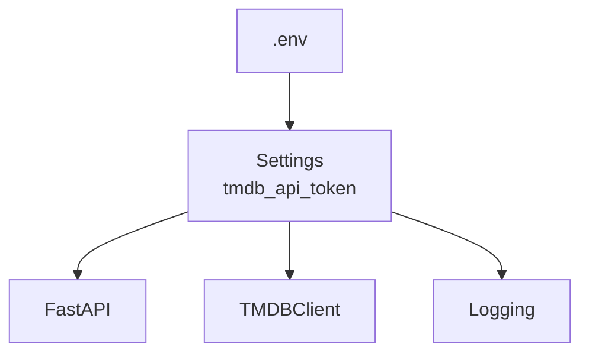

# Tutorial

## Setup
### Make the application directory and change to it
```bash
mkdir movie-to-bear
cd movie-to-bear
```

### Initialise the app with `uv`
```bash
uv init
```

### Create a virtual Python 3.12 environment
```bash
uv python install 3.12
uv python pin 3.12

```

#### Issue
When I ran `uv python pin 3.12` i recevied the following error: 
```bash
error: The requested Python version `3.12` is incompatible with the project `requires-python` value of `>=3.13`.
```

I changed the `pyproject.toml` file:
```yaml
requires-python = ">=3.13"
```
to:
```yaml
requires-python = ">=3.12"
```
Rerunning the command worked:
```bash
Pinned `.python-version` to `3.12`
```

Then run the following: 
```bash
uv sync

```

I changed the `pyproject.toml` file:
```yaml
requires-python = ">=3.12"
```
to:
```yaml
requires-python = ">=3.12,<3.13"
```
### Add dependencies
```bash
uv add fastapi uvicorn httpx pydantic-settings logstruct
```

### Add dev dependencies
```bash
uv add --dev pytest pytest-asyncio coverage ruff
```
### Confirm Python and `uv` versions:
```bash
uv run python --version
uv --version
```

They should be something like:
```bash
Python 3.12.8
uv 0.11.14 (3fdfdc7d4 2026-05-12 x86_64-pc-windows-msvc)
```


## Lesson 1 — Set up the project structure

### 1. Create the diretories
```text
movie-to-bear/
├── .python-version
├── pyproject.toml
├── uv.lock
├── README.md
│
├── src/
│   └── movie_to_bear/
│       ├── __init__.py
│       └── main.py
│
└── tests/
    ├── __init__.py
    └── test_health.py
```

Run in the project folder: 
```bash
mkdir src\movie_to_bear
mkdir tests
```
Create package files:
```powershell
New-Item src\movie_to_bear\__init__.py
New-Item src\movie_to_bear\main.py
New-Item tests\__init__.py
New-Item tests\test_health.py

```

### 2. Install our dependencies
```bash
uv add fastapi uvicorn httpx pydantic-settings logstruct
uv add --dev pytest pytest-asyncio coverage ruff
```

Runtime dependencies
: These are needed when the application runs
Development Dependancies
: These are needed when we are developing/testing

> This was done in the setup already?!

### 3. Configure the `src` layout
The python package is here:
```text
src/
└── movie_to_bear/
```
Our tests are here:
```text
tests/
```

When we run the following:
```bash
uv run pytest

```
We want Python to be able to do:
```python
from movie_to_bear.main import app
```
without manually modifying `PYTHONPATH`.

Configure the package in `pyproject.toml`:

```yaml
[build-system]
requires = ["hatchling"]
build-backend = "hatchling.build"

[tool.hatch.build.targets.wheel]
packages = ["src/movie_to_bear"]
```

Run: 
```bash
uv sync
```

### 4. Create the first FastAPI application
The `src/movie_to_bear/main.py` should contain the below code:
```python
from fastapi import FastAPI


app = FastAPI(
    title="Movie to Bear",
    version="0.1.0",
)


@app.get("/health")
async def health() -> dict[str, str]:
    return {"status": "ok"}

```

### 5. Run the application
From the `terminal`, run:
```bash
uv run uvicorn movie_to_bear.main:app --reload
```

Open in a browser:
```text
http://127.0.0.1:8000/health
```
You should get:
```json
{
  "status": "ok"
}
```
FastAPI will also automatically provide interactive API documentation at:
```text
http://127.0.0.1:8000/docs
```
and the alternative OpenAPI UI at:
```text
http://127.0.0.1:8000/redoc
```

### 6. Now write the test
The `tests/test_health.py` should contain:
```python
from fastapi.testclient import TestClient

from movie_to_bear.main import app


client = TestClient(app)


def test_health() -> None:
    response = client.get("/health")

    assert response.status_code == 200
    assert response.json() == {"status": "ok"}
```

Run the test:
```bash
uv run pytest
```

### 7. Run `coverage`
In the `terminal`, run:
```bash
uv run coverage run -m pytest
```

Then run:
```bash
uv run coverage report
```

## Lesson 2 — Configuration and environment variables
### 1. The problem we're solving
The goal is to make the application able to read configuration such as the TMDB API token without putting secrets into Python source code.

Use `pydantic-settings` to store secrets, etc.

### 2. Create `config.py`
Create `src/movie_to_bear/core/config.py`   
As well as src/movie_to_bear/core/\_\_init\_\_.py`

The `config.py` file should contain the following:
```python
from pydantic_settings import BaseSettings, SettingsConfigDict


class Settings(BaseSettings):
    tmdb_api_token: str

    model_config = SettingsConfigDict(
        env_file=".env",
        env_file_encoding="utf-8",
        case_sensitive=False,
    )


settings = Settings()
```

> Understand the following:
- `BaseSettings`    
    It is designed to populate fields from configuration sources, e.g. environment variables.
- `env_file=".env"`   
    This tells Pydantic Settings to look for a `.env` file.
- `case_sensitive=False`   
    This tells Pydantic Settings to ignore case. 


### 3. Create `.env` file

At the project root, create the `.env` file with the following:
```text
TMDB_API_TOKEN=test-token
```

### 4. Create `.env.example` file
At the project root, create the `.env.example` file:
```text
TMDB_API_TOKEN=
```
This files documents what configuration a developer needs.
The `.env.example` file can be committed to Git.   
The `.env` file should not be.

### 5. Update `.gitignore` file
Check your `.gitignore` file.

If `.env` isn't already there, add:
```text
.env
```

### 6. Test the configuraiton manually
From the `terminal`, run:
```bash
uv run python

```
In the REPL: 
```python
from movie_to_bear.core.config import settings
print(settings.tmdb_api_token)
```

The result should be: 
```text
test-token
```
Exit the REPL with:
```python
exit()
```

### 7. Why not just use `os.getenv()`?

```python
import os

token = os.getenv("TMDB_API_TOKEN")
```
Doing it this way spreads `os.getenv()` throughout the application as it grows. 

Using Pydantic Settings, allows a single configuration object: 

```python
settings.tmdb_api_token
```

### 8. Add a configuration test
Create `tests/test_config.py` with the following content:
```python
from movie_to_bear.core.config import settings


def test_tmdb_api_token_is_loaded() -> None:
    assert settings.tmdb_api_token == "test-token"
```

Run it:
```bash
uv run pytest
```


### 9. One problem with our test
Tests should control their own configuration.
This can be improved using pytest fixtures and environment-variable overrides.

### 10. Configuration precedence
In Pydantic Settings is that configuration can come from different sources.

An environment variable can override the `.env` variable.
For example, in `.env`:
```text
TMDB_API_TOKEN=test-token
``` 
but Powershell has:
```powershell
$env:TMDB_API_TOKEN="another-token"
```
then the environment variable takes precedence.

This is useful in production because `.env` files are not needed.

The Python application doesn't need to know where the value came from.

### 11. What we've achieved
The application as a configuration boundry:


## Lesson 3 — Structured logging
### 1. The target architecture
### 2. Create the logging module
Create `src/movie_to_bear/core/logging.py` with the following content:
```python
import logging
import sys

import structlog


def configure_logging() -> None:
    logging.basicConfig(
        format="%(message)s",
        stream=sys.stdout,
        level=logging.INFO,
    )

    structlog.configure(
        processors=[
            structlog.stdlib.filter_by_level,
            structlog.stdlib.add_logger_name,
            structlog.stdlib.add_log_level,
            structlog.processors.TimeStamper(fmt="iso"),
            structlog.processors.JSONRenderer(),
        ],
        logger_factory=structlog.stdlib.LoggerFactory(),
        wrapper_class=structlog.stdlib.BoundLogger,
        cache_logger_on_first_use=True,
    )

```

### 3. Refactor `main.py`
```python
import structlog
from fastapi import FastAPI

from movie_to_bear.core.logging import configure_logging


def create_app() -> FastAPI:
    configure_logging()

    app = FastAPI(
        title="Movie to Bear",
        version="0.1.0",
    )

    logger = structlog.get_logger()

    @app.get("/health")
    async def health() -> dict[str, str]:
        logger.info(
            "health_check",
            status="ok",
        )

        return {"status": "ok"}

    return app


app = create_app()
```


> Understand the following concepts:
- **Application Factory**   
    ```python
    def create_app() -> FastAPI:
    ```
    This function is capable of constructing our application.
    
    ´´´python
    app = create_app()
    ```
    This creates the normal application instance that `Unicorn` uses.

### 4. Run the tests
```bash
uv run pytest
uv run uvicorn movie_to_bear.main:app --reload
curl http://127.0.0.1:8000/health
```

### 5. Understand what we did
The below code creates an event with two pieces of information, `event` and `status`:
```python
logger.info(
    "health_check",
    status="ok",
)

```
The processes add `logger`, `level` and `timestamp`.

`JSONRenderer` serialises the event.    
We don't construct the JSON ourselves.

Don't do this:
```python
logger.info(
    '{"event": "health_check", "status": "ok"}'
)
```

### 6. Add a meaningful field

Change the following code in `src\movie_to_bear\main.py`:
```python
logger.info(
    "health_check",
    status="ok",
)
```
to:
```python
logger.info(
    "health_check",
    status="ok",
    component="api",
)
```


### 7. Don't test the JSON string
`structlog` provides testing utilities specifically for capturing log events.

Modify `tests/test_health.py` to contain:
```python
import structlog
from fastapi.testclient import TestClient

from movie_to_bear.main import create_app


def test_health() -> None:
    app = create_app()
    client = TestClient(app)

    with structlog.testing.capture_logs() as logs:
        response = client.get("/health")

    assert response.status_code == 200
    assert response.json() == {"status": "ok"}

    health_logs = [
        log
        for log in logs
        if log["event"] == "health_check"
    ]

    assert len(health_logs) == 1
    assert health_logs[0]["status"] == "ok"
    assert health_logs[0]["component"] == "api"

```

We're not asserting:
```python
assert some_json_string == "..."
```

We're inspecting the actual structured event.   
That makes the test much less brittle.


### 9. A subtle problem